# 🔓 Week 3 — Password Cracking with JTR & NetworkWalks Tools

**Three locked PDFs, two toolchains, and a wordlist that had to get a lot bigger before it earned its keep.**

---

## 📌 Continuity Note

This one picks up right where the last repo left off — Week 3 of the Cybersecurity & Ethical Hacking Program at Networkwalks. Also part of this series:

- **Week 1:** [Kali-Linux-Lab-Setup-in-Virtualbox](https://github.com/suvayanghosh/Kali-Linux-Lab-Setup-in-Virtualbox)
- **Week 2:** [Footprinting-Reconnaissance-Lab](https://github.com/suvayanghosh/Footprinting-Reconnaissance-Lab)

---

## 📑 Table of Contents

- [Backstory](#-backstory)
- [What I Set Out to Do](#-what-i-set-out-to-do)
- [Scope & Authorization](#️-scope--authorization)
- [Tools & Techniques Used](#-tools--techniques-used)
- [Walkthrough](#-walkthrough)
- [Findings Snapshot](#-findings-snapshot)
- [Lessons Learned](#-lessons-learned)
- [Ethical Use Notice](#-ethical-use-notice)
- [Tools & Resources](#-tools--resources)
- [Author](#-author)
- [Project Info](#-project-info)

---

## 📖 Backstory

Week 3 handed over three separate locked PDFs and the same brief, three times over: extract the hash, crack the password, capture the flag inside. And to make sure the lesson actually landed, I had to do all three twice — once with a proper installed toolchain, once with nothing but a browser tab.

**Module 1** goes the traditional route — John the Ripper, driven through the Johnny GUI, hash pulled out with a third-party web extractor first. **Module 2** does the exact same three files using NetworkWalks' own in-browser Hash Calculator and Password Cracker, zero installation required. Two of the three passwords fell instantly either way. The third one had opinions about that, and made the browser tool work for it.

Every screenshot below is from my own run, mapped file by file, tool by tool.

---

## 🎯 What I Set Out to Do

- Extract the crackable `$pdf$...` hash from three separate locked PDFs and recover each password using **John the Ripper**, driven through the **Johnny GUI**.
- Repeat the same three recoveries using **NetworkWalks' Hash Calculator** and **Password Cracker** — browser-based, zero installation.
- Capture the flag hidden inside each unlocked PDF as proof of a successful crack.
- Actually notice when a wordlist isn't cutting it, instead of just declaring defeat at "Access Denied."

---

## 🛡️ Scope & Authorization

| Target | Basis for Testing |
| --- | --- |
| `My Locked PDF1.pdf`, `My Locked PDF2.pdf`, `My Locked PDF3.pdf` | Provided directly by Networkwalks Academy as designated training files for this lab exercise |

⚠️ **Disclaimer:** All three files cracked in this repo were handed out specifically for this exercise — none of it is real data, and no other file, account or system was touched. Password cracking is genuinely useful to understand as a security professional, but it's also exactly the kind of technique that needs a very clear "yes, you're allowed to do this" before you point it at anything. Here, that permission was built into the assignment.

---

## 🧰 Tools & Techniques Used

| Tool | Purpose |
| --- | --- |
| 🖥️ Windows | Operating system used for both modules |
| 🔓 John the Ripper (JTR) | Core CLI password-cracking engine — Unix in origin, now cross-platform |
| 🖱️ Johnny GUI | Point-and-click front end for JTR, so no commands had to be typed by hand |
| 🔎 Online PDF Hash Extractor | Pulled the crackable `$pdf$...` hash out of each locked file ahead of the JTR run |
| 🧮 NetworkWalks Hash Calculator | Browser-based hash extraction, entirely client-side, zero install |
| ⚡ NetworkWalks Password Cracker | Browser-based dictionary attack engine, supports both a built-in wordlist and custom `.txt` uploads |

---

## 🪜 Walkthrough

### Module 1 — Password Cracking with JTR & Johnny GUI (W3-PM1)

The "install things and mean it" route. Johnny was pointed at `john.exe` once, then reused for all three files — extract a hash with the online tool, load it into Johnny, start the attack, catch the flag.

#### 📄 PDF 1

Uploaded `My Locked PDF1.pdf` to the online hash extractor and pulled out its `$pdf$...` hash.

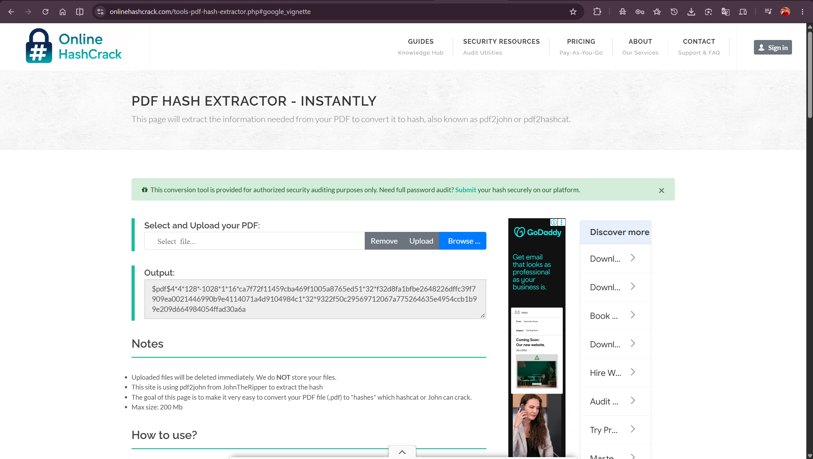

Loaded the hash into Johnny and started the attack. Cracked almost immediately — recovered password: **`good-luck`**.

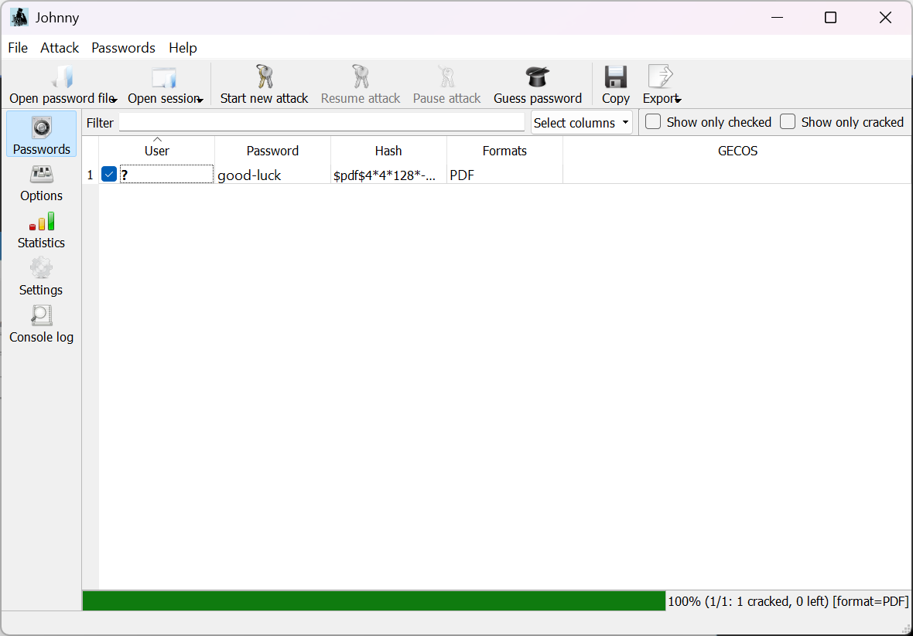

Opened the PDF with `good-luck` and captured the first flag: **`nw{cybersecurity_flag_captured_2608}`**

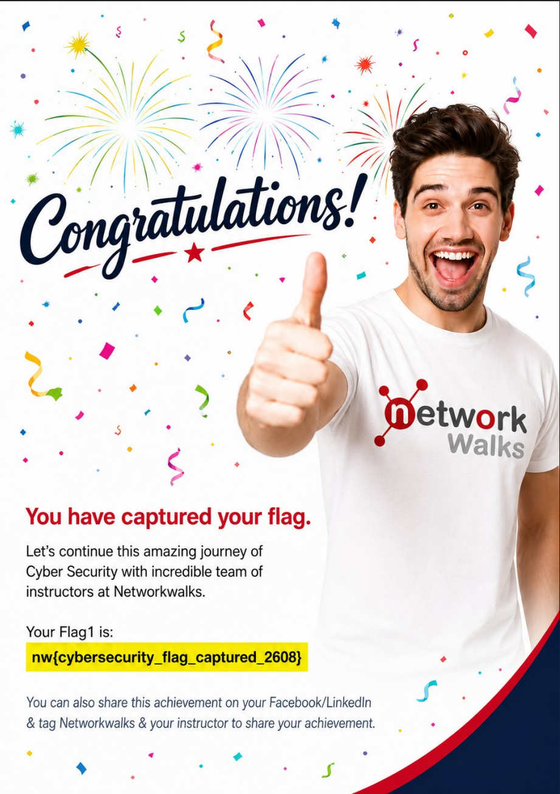

#### 📄 PDF 2

Same process, different file. Extracted the hash for `My Locked PDF2.pdf`.

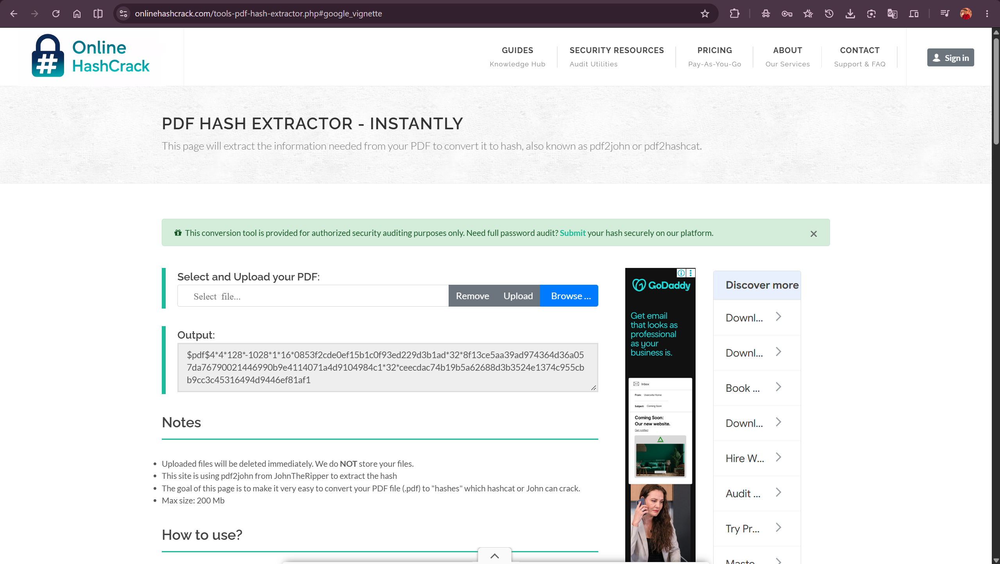

Johnny made short work of it — recovered password: **`password1`**.

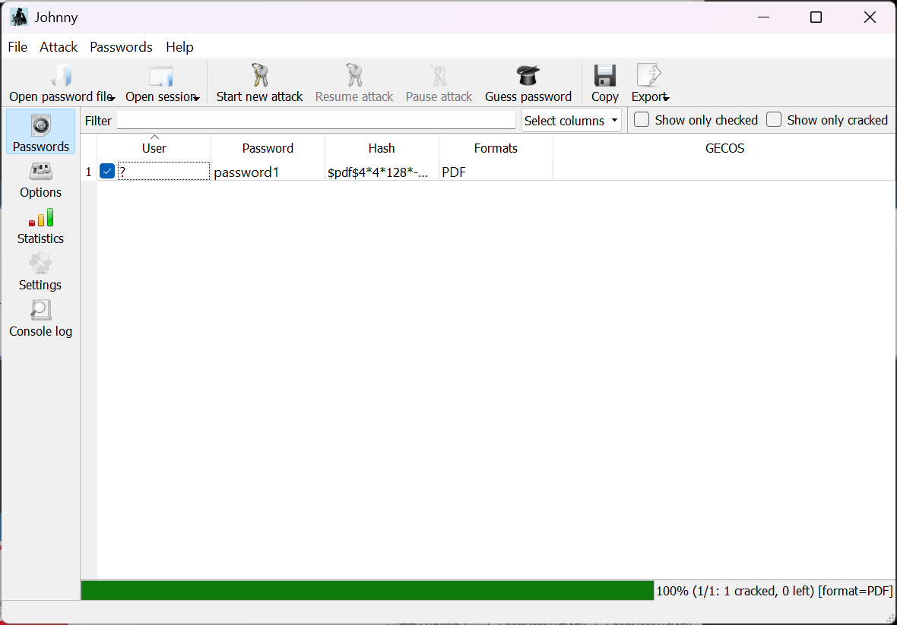

Unlocked the PDF and captured the second flag: **`nw{networkwalks_persistence_jtr_270521}`**

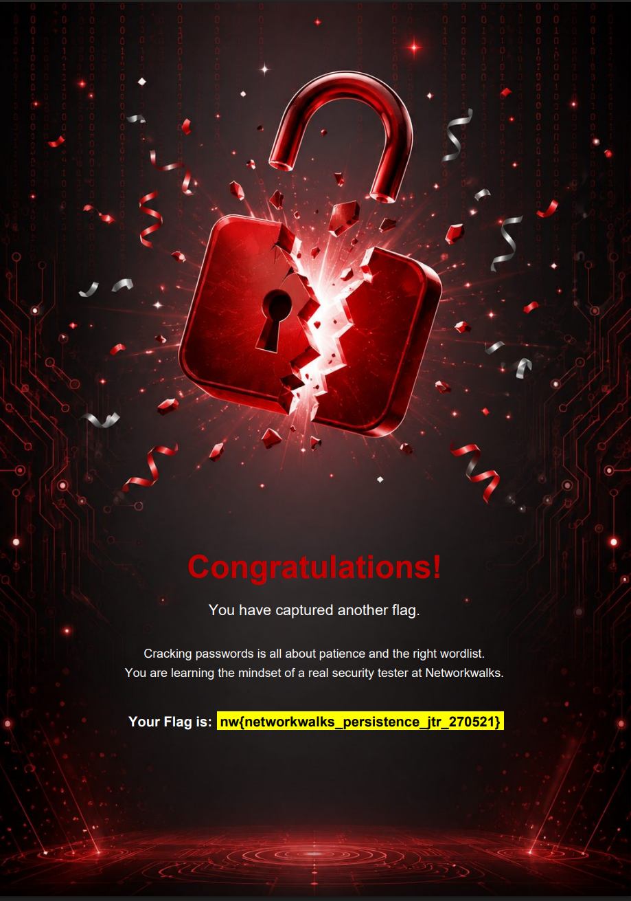

#### 📄 PDF 3

Hash extracted for `My Locked PDF3.pdf`.

Cracked by Johnny — recovered password: **`1qaz2wsx`**.

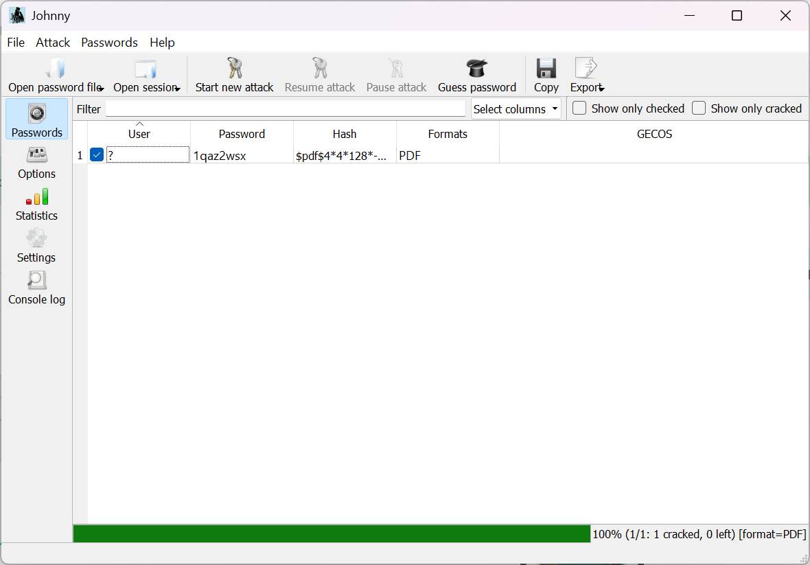

Unlocked the PDF and captured the third flag: **`nw{networkwalks_flag_260821_1}`**

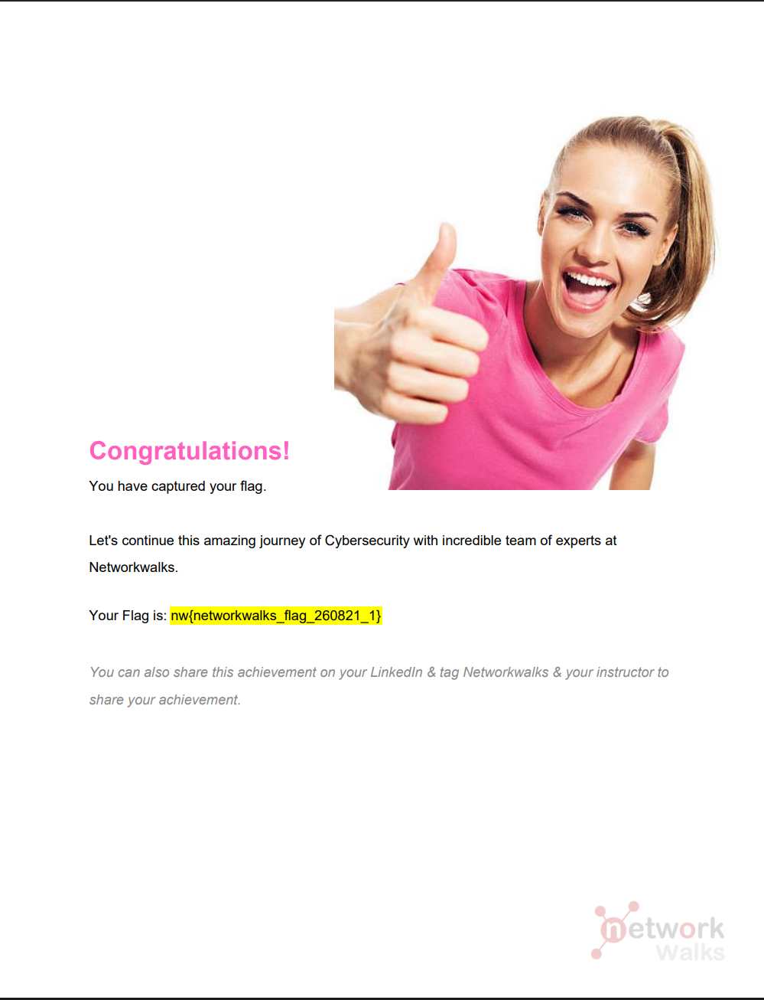

All three cracked cleanly through JTR + Johnny, no drama, no repeat attempts needed.

---

### Module 2 — Password Cracking with NetworkWalks Tools (W3-PM2)

Same three files, zero installation this time. This is also where things got mildly interesting.

#### 📄 PDF 1 — the one that fought back

Extracted the hash for `My Locked PDF1.pdf` using NetworkWalks' Hash Calculator.

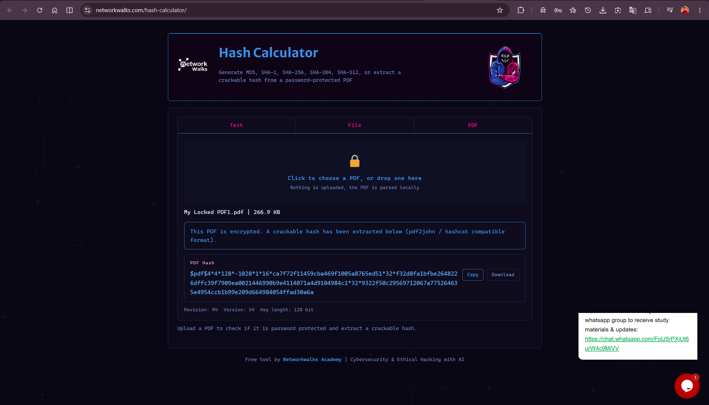

First attempt: pasted the hash into the Password Cracker and ran it against the **built-in 100-password list**. Result: `Access Denied`, wordlist exhausted, no match.

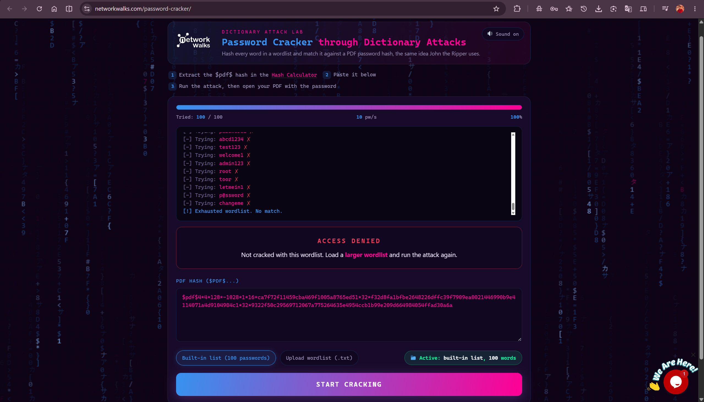

Second attempt: uploaded a bigger custom wordlist (`fasttrack.txt`, 221 words). Also `Access Denied`.

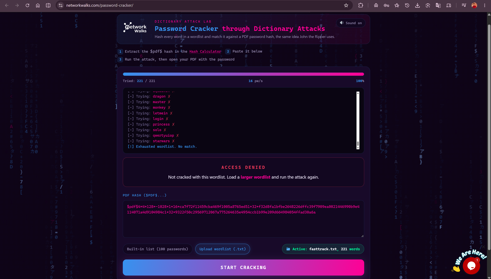

Third attempt: uploaded a much larger wordlist (`JTR_default_password.txt`, 3,556 words). This time it landed a match at 3,456/3,556 — recovered password: **`good-luck`**, matching exactly what Johnny found in Module 1.

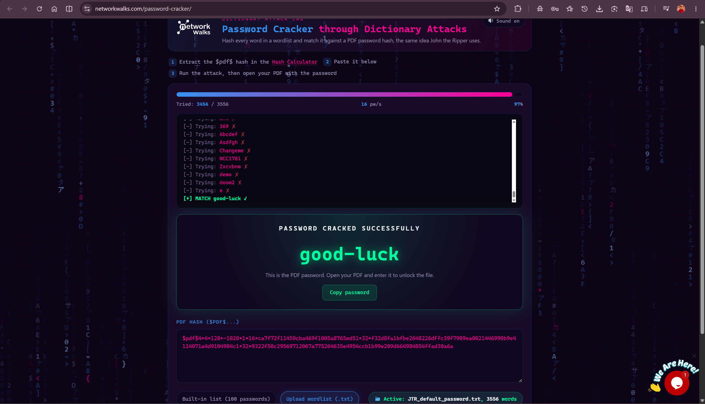

#### 📄 PDF 2

Hash extracted, pasted into the Password Cracker, ran against the built-in 100-word list. Matched almost immediately at attempt 91/100 — recovered password: **`password1`**.

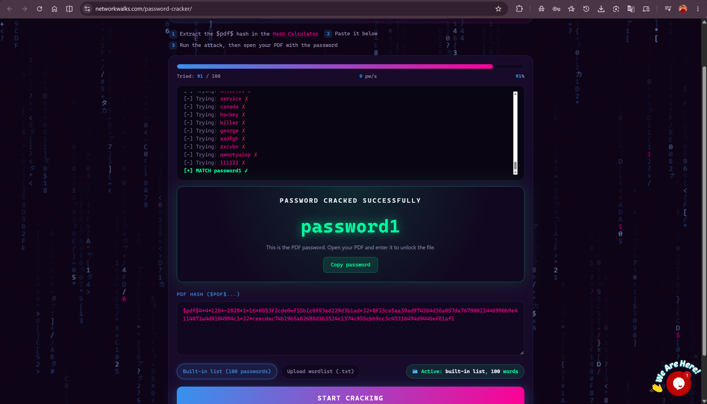

#### 📄 PDF 3

Same built-in 100-word list, matched even faster this time at attempt 35/100 — recovered password: **`1qaz2wsx`**.

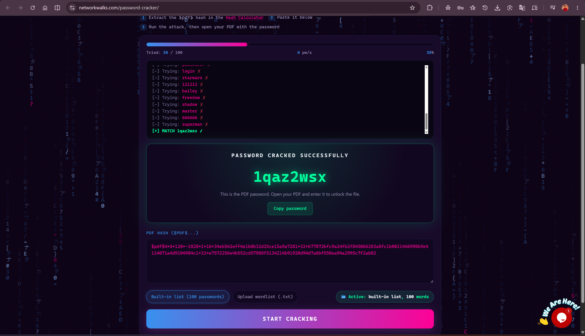

---

## 📊 Findings Snapshot

| File | Module 1 (JTR + Johnny) | Module 2 (NetworkWalks Tools) | Password | Flag Captured |
| --- | --- | --- | --- | --- |
| PDF 1 | Cracked on the first attempt | Needed 3 wordlists (100 → 221 → 3,556 words) before matching at 3,456/3,556 | `good-luck` | `nw{cybersecurity_flag_captured_2608}` |
| PDF 2 | Cracked on the first attempt | Cracked on the built-in 100-word list, matched at 91/100 | `password1` | `nw{networkwalks_persistence_jtr_270521}` |
| PDF 3 | Cracked on the first attempt | Cracked on the built-in 100-word list, matched at 35/100 | `1qaz2wsx` | `nw{networkwalks_flag_260821_1}` |

Same three passwords, recovered twice over through two completely different toolchains — the only real difference was how many wordlists PDF 1 needed before the browser tool caught up with Johnny.

---

## 💡 Lessons Learned

**Not all "weak" passwords are equally weak.** `password1` and `1qaz2wsx` fell to a 100-word list without a fight. `good-luck` didn't — it took a wordlist over 35 times larger before the same tool found it.

**A tool is only as good as the list behind it.** JTR + Johnny cracked all three files without needing any extra configuration, while the browser-based cracker needed a manual wordlist upgrade to catch up on the harder password. Same technique, different default ammunition.

**"Access Denied" isn't the end of the story.** It would've been easy to stop at the first exhausted wordlist and call PDF 1 uncrackable. It just needed a bigger dictionary, not a different approach.

**Hash extraction is still its own step.** Neither JTR nor the NetworkWalks Password Cracker can touch a locked PDF directly — every single one of the six crack attempts started with pulling a hash out first.

---

## 🔐 Ethical Use Notice

All three files cracked in this repository were provided directly by Networkwalks Academy for this exercise — not sourced, guessed at, or taken from anyone's real account. The point of this lab is to see, first-hand, how quickly (or how stubbornly) a password gets recovered depending on the wordlist behind the attack. Please don't point either of these toolchains at a file, account or system you don't own or have explicit permission to test.

---

## 🔗 Tools & Resources

- **John the Ripper:** <https://www.openwall.com/john/>
- **Johnny GUI:** <https://openwall.info/wiki/john/johnny>
- **NetworkWalks Hash Calculator:** <https://networkwalks.com/hash-calculator/>
- **NetworkWalks Password Cracker:** <https://networkwalks.com/password-cracker/>
- **Online PDF Hash Extractor:** <https://www.onlinehashcrack.com/tools-pdf-hash-extractor.php>

---

## 👤 Author

**Suvayan Ghosh** — Cybersecurity Analyst | Networkwalks Internship, Batch B083D

**LinkedIn:** <https://www.linkedin.com/in/suvayanghosh/>

---

## 📌 Project Info

**Type:** Cybersecurity Internship Lab Report | **Modules:** W3-PM1, W3-PM2 | **Flags Captured:** 3/3 | **Status:** Completed
